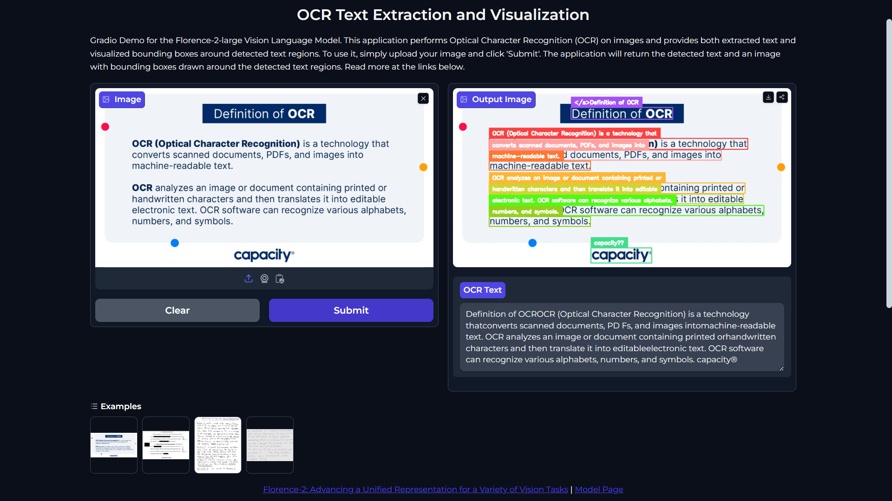

# TextSnap

[**Florence-2**](https://arxiv.org/abs/2311.06242) is an advanced vision foundation model developed by Microsoft, designed to handle a wide range of vision and vision-language tasks using a prompt-based approach. This model can interpret simple text prompts to perform functions like captioning, object detection, and segmentation. Its sequence-to-sequence architecture enables outstanding performance in zero-shot and fine-tuned settings, making it a highly competitive vision foundation model. This project utilizes [**Florence-2**](https://huggingface.co/microsoft/Florence-2-large-ft) to demonstrate robust OCR (Optical Character Recognition) capabilities, offering both text extraction and enhanced visualization of recognized text regions in images.

Below is a screenshot of the application in action:

## Project Structure

The project is structured as follows:

- `src\`: The source code directory containing the project's main files.

  - `florence\`: The folder containing the source code for the Florence-2 model loading and OCR task adaptation.

    - `model.py`: The file that contains the Florence-2 vision foundation model for generating responses.
    - `task.py`: The file that contains the code for adapting the model to the OCR task.

  - `utils\`: The folder containing the project's utility function.

    - `processing.py`: The file containing the project's utility functions regarding OCR tasks.

  - `logger.py`: This file contains the project's logging configuration.
  - `exception.py`: This file contains the exception handling for the project.

- `app.py`: The main file that contains the Gradio application for the OCR task.
- `requirements.txt`: The file containing the project's required dependencies.
- `LICENSE`: The license file for the project.
- `README.md`: The README file that contains information about the project.
- `assets`: The folder that contains the screenshots for working on the application.
- `images`: The folder that contains the images for testing the application.

## Tech Stack

- Python (for the programming language)
- PyTorch (for the deep learning framework)
- Supervision (for the easy-to-use utils for Computer Vision tasks)
- Hugging Face Transformers Library (for the vision large language model)
- Gradio (for the web application)
- Hugging Face Spaces (for hosting the gradio application)

## Usage

The web application allows you to upload an image, and the OCR models will extract text from it, providing two main functionalities: **text extraction** and **text visualization**.

- Text extraction cleans and formats the extracted text, ensuring proper spacing between words and after punctuation marks.
- Text visualization draws bounding boxes around recognized text regions on the image, offering a clear and enhanced visual representation.

To use the application, follow these steps:

1. Open the web application in your browser.
2. Upload an image containing text that you want to extract and visualize.
3. Click the **Submit** button to process the image.
4. The application will display the extracted text and the image with bounding boxes around the recognized text regions.
5. You can download the processed image with bounding boxes or copy the extracted text to your clipboard.
6. You can also share the application results with others by clicking the **Share via Link** button.
7. Click the **Clear** button to clear the input and output fields.

This application can assist in document digitization, automated data entry, and improved accessibility for visually impaired individuals by recognizing text from images.

## Results

For results, refer to the `assets/` directory for the output screenshots, which show the application in action.

## Contributing

Contributions are welcome! If you would like to contribute to this project, please raise an issue to discuss the changes you want to make. Once the changes are approved, you can create a pull request.

## License

This project is licensed under the [MIT License](LICENSE).

## Contact

If you have any questions or suggestions regarding the project, feel free to reach out to me on my GitHub profile.

Happy coding! 🚀
